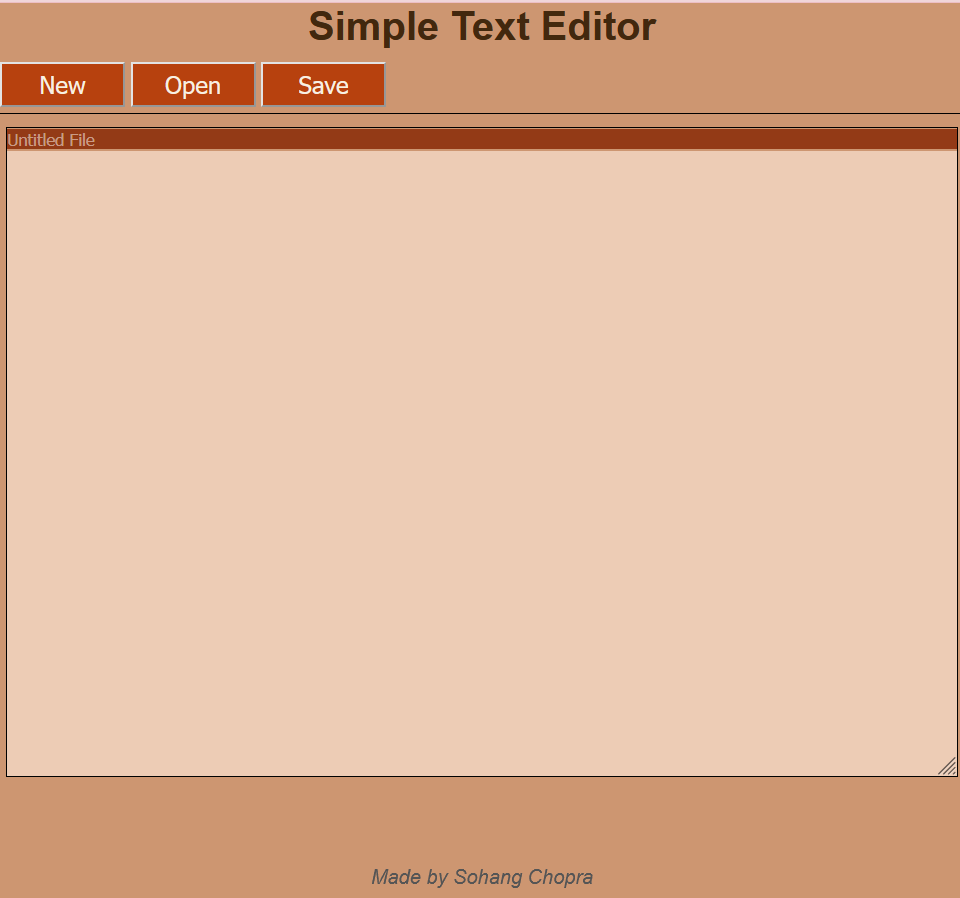

# Simple Text Editor (Web)
This is a simple web-based text editor, which I created for answering an interview question / code challenge.

## Functionality
It supports Opening, Saving and Editing text files from a Web page.

## Installation
- Clone this repository.
- Install [Flask](https://flask.palletsprojects.com/en/2.0.x/) using [Pip](https://docs.python.org/3/installing/index.html) - `pip install flask`.
- Change directory to project directory `cd simple-text-editor` and run `python __init__.py`.
- Open `localhost:5000` in any web browser.

## Technology Stack
- **Backend** - Python 3 with Flask
- **Frontend** - HTML 5 / CSS 3 / JavaScript, Font Awesome library (for drawing logo icon)

## Idea
Make this into an online clone of Notepad++! (Why? Because I like Notepad++!)

**Note:** It definitely has to be *fast*, because speed is my favourite feature of Notepad++.
